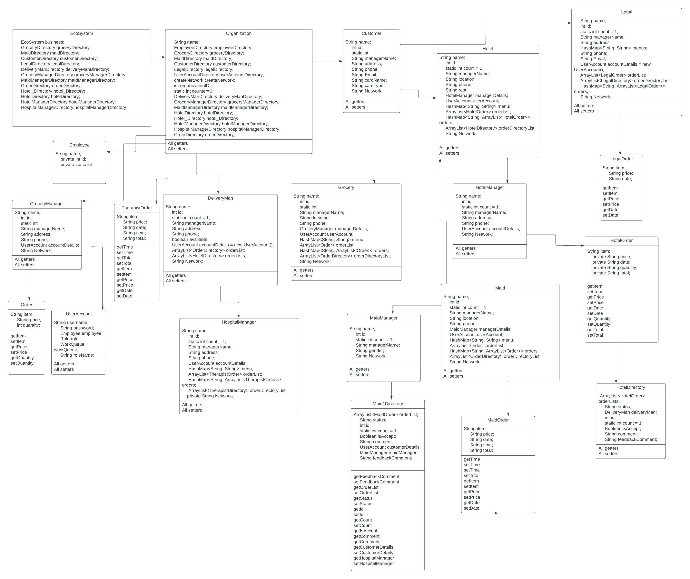
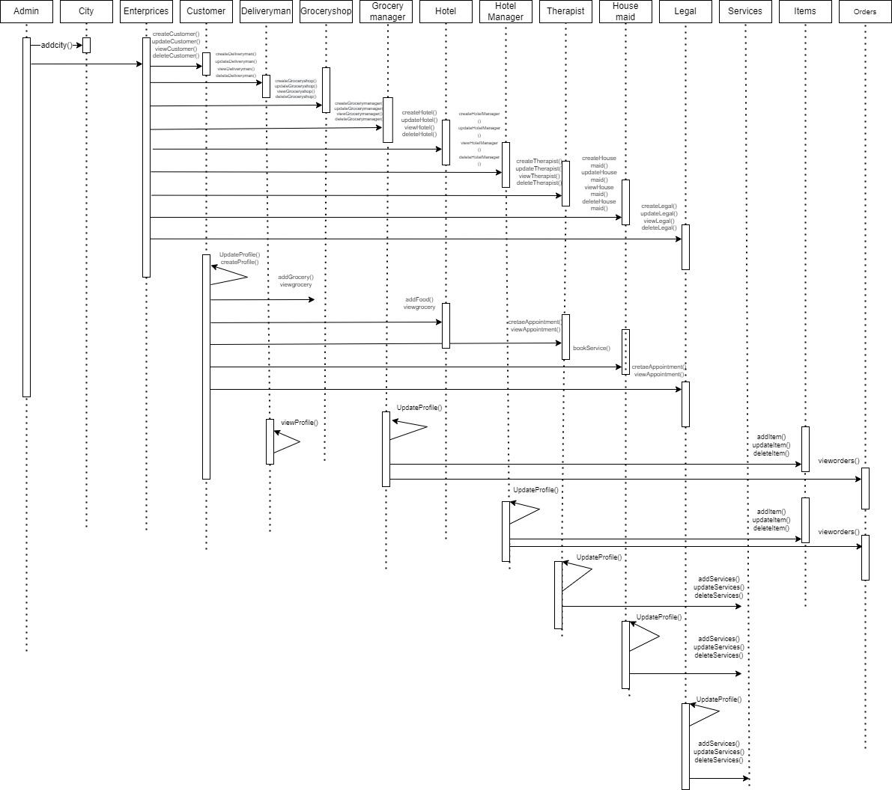

# Nucleus

Nucleus is a multi-service marketplace desktop application that connects customers with service providers across five verticals: grocery, hotel, hospital care, legal services, and home (maid) services. One login, one platform, role-specific dashboards for every participant.

Built as the final project for INFO 5100 (Application Engineering and Development) at Northeastern University. Designed and implemented end to end by Aravind Sundaravadivelu.

## Features

- **Nine role-based user types**: customer, system admin, delivery person, and admin/manager roles for each service vertical, each with its own role-scoped work area
- **Work-queue request routing**: customer requests flow into the receiving organization's work queue, where staff pick up, process, and resolve them with status tracking
- **Five service verticals** on one platform: grocery ordering with delivery, hotel booking, hospital care requests, legal services, and maid services
- **Email notifications** to users via JavaMail
- **Object persistence** with DB4O: the full ecosystem (organizations, accounts, requests) survives restarts, with seeded data in `Databank.db4o`
- **Login and signup** with per-role landing pages

## Architecture

Layered design with a strict separation between the business model and the UI:

- `src/Business` - the domain: `EcoSystem` (singleton root), organizations and directories per vertical, `UserAccount`/`Role` for access control, `WorkQueue`/`WorkRequest` for request routing, `DB4OUtil` for persistence
- `src/userinterface` - Swing work areas, one package per role

### Class diagram

### Sequence diagram

## Tech Stack

- Java (Swing, NetBeans GUI Builder)
- DB4O 8 object database
- JavaMail for email notifications
- JCalendar, Log4j
- NetBeans project (Ant build)

## Running It

1. Open the project in NetBeans (or any IDE that understands `nbproject`/Ant)
2. Required jars are bundled in `library/` and the project root (`db4o`, `javax.mail`, `jcalendar`, `log4j`, `AbsoluteLayout`)
3. Run the project; the seeded `Databank.db4o` provides initial organizations and accounts
4. Sign up as a customer, or log in with an admin account to manage a vertical

## Project Docs

- Final presentation: `AED_FINAL_PROJECT.pptx (1).pdf`
